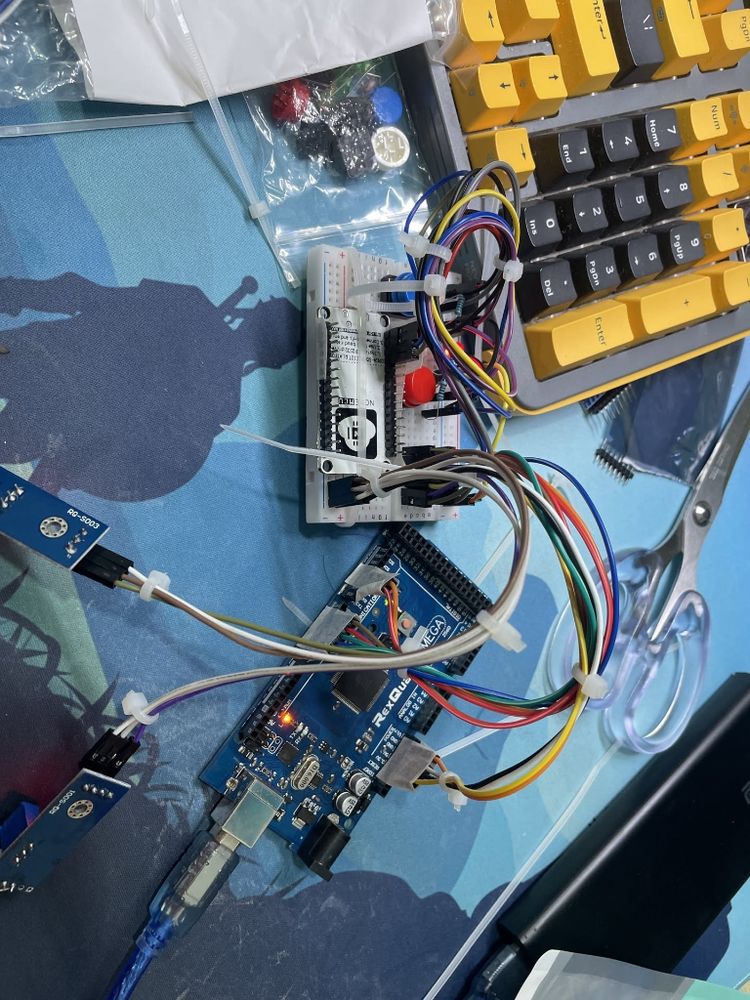

# Health Monitor (Arduino)

A non-blocking, efficient health and environment monitor based on Arduino Mega 2560.



## Project Overview
This device monitors environmental conditions (temperature, humidity, sound levels) and allows for local and remote control of an alert light. It is designed to be a robust IoT node with:
- **Non-blocking Architecture**: Uses `millis()` for multitasking vs `delay()`.
- **Stable Communication**: JSON-based serial communication for easy integration.
- **Resource Efficiency**: Optimized memory usage to prevent crashes.

## Components List
- **Main Controller**: Arduino Mega 2560
- **Communication**: ESP8266 NodeMCU / ESP-01 (WiFi Module)
- **Sensors**:
  - DHT11 Temperature & Humidity Sensor
  - Sound Sensor Module (Microphone with Digital Out)
- **Actuators**:
  - LED Module or Relay (for Light)
- **User Input**:
  - 2x Push Buttons (Tactile Switches)
  - 2x 10kΩ Resistors (for pull-down)
- **Misc**: Breadboard, Jumper Wires

## Hardware Wiring Guide
Based on the code logic and standard connections:

| Component | Pin Name | Arduino Mega Pin | Description |
|-----------|----------|------------------|-------------|
| **DHT11** | VCC | 5V | Power |
| | GND | GND | Ground |
| | DATA | **D2** | Sensor Data |
| **Sound** | VCC | 5V | Power |
| | GND | GND | Ground |
| | OUT | **D3** | Digital Threshold Output |
| **Light** | VCC | 5V | Power |
| | GND | GND | Ground |
| | IN | **D4** | Control Signal (High=ON) |
| **Btn (Cancel)** | VCC | 5V | One side of switch |
| | Signal | **D5** | Other side (w/ 10k pull-down to GND) |
| **Btn (Active)** | VCC | 5V | One side of switch |
| | Signal | **D6** | Other side (w/ 10k pull-down to GND) |
| **ESP8266** | RX | **TX2 (D16)** | Mega sends data to WiFi |
| | TX | **RX2 (D17)** | Mega receives commands |
| | VCC | 5V/3.3V* | Check module voltage requirements! |
| | GND | GND | Common Ground |

*> **Note:** If using a raw ESP-01, it requires 3.3V. NodeMCU boards usually have an onboard regulator and can take 5V via VIN/USB.*

## Data Protocol
The device sends a JSON packet to `Serial2` (Pins 16/17) every 3 seconds:
```json
{
    "breathing": 12,        // Breathing/Sound activity index
    "humidity": 45.00,      // Relative Humidity %
    "temperature": 24.50,   // Degrees Celsius
    "deviceCode": "...",    // Unique Device ID
    "alert": 0              // Light State (0=OFF, 1=ON)
}
```

## Compilation
1. Open `main.ino` in Arduino IDE.
2. Ensure you have the standard `DHT` library installed.
3. Select **Tools > Board > Arduino Mega or Mega 2560**.
4. Verify and Upload.
